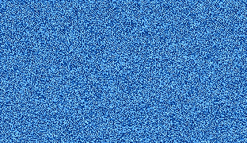

# Static/Noise GIF Generation

This code uses Python's PIL/Image and imageio to generate "static" or completely random images such as the one below. This allows for customization of gif size, color pallete, and number of images within. The code works by generating a sequence of blank images and then iterating through each pixel to assigns a random color. Combining multiple such images into a gif creates the noise effect. 

**See the full description and 'how-to' in the [StaticGen.ipynb](StaticGen.ipynb) file.**   

